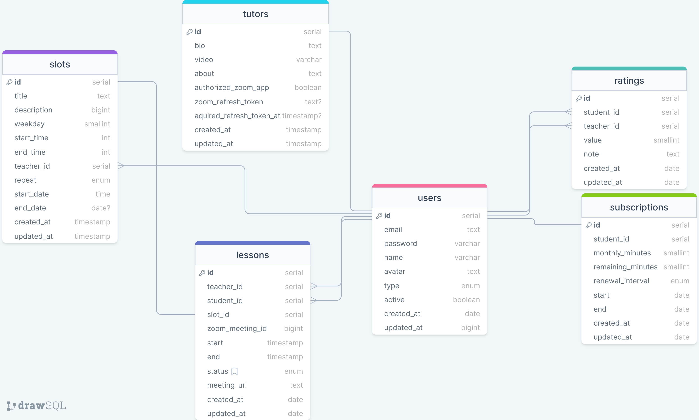

# Space

## Data Models

Check [DrawSQL](https://drawsql.app/teams/no-sim/diagrams/space)

# Tools

- [`pg`](https://node-postgres.com/)
- [`node-pg-migrate`](https://salsita.github.io/node-pg-migrate/getting-started)

- https://gist.github.com/Oleshkooo/a403dc8b85e98070fb39844dfb3c0208
- https://www.digitalocean.com/community/tutorials/how-to-set-up-apache-virtual-hosts-on-ubuntu-16-04
- https://docs.vultr.com/how-to-configure-apache-as-a-reverse-proxy-with-mod-proxy-54152
- https://developer.chrome.com/blog/background-blur
