# litespace - ERD documentation
## Summary

- [Introduction](#introduction)
- [Database Type](#database-type)
- [Table Structure](#table-structure)
	- [users](#users)
	- [tutors](#tutors)
	- [rules](#rules)
	- [calls](#calls)
	- [call_members](#call_members)
	- [call_events](#call_events)
	- [lessons](#lessons)
	- [lesson_members](#lesson_members)
	- [interviews](#interviews)
	- [ratings](#ratings)
	- [plans](#plans)
	- [coupons](#coupons)
	- [topics](#topics)
	- [user_topics](#user_topics)
	- [invites](#invites)
	- [subscriptions](#subscriptions)
	- [reports](#reports)
	- [report_replies](#report_replies)
	- [gifts](#gifts)
	- [rooms](#rooms)
	- [room_members](#room_members)
	- [messages](#messages)
	- [withdraw_methods](#withdraw_methods)
	- [invoices](#invoices)
- [Relationships](#relationships)
- [Database Diagram](#database-Diagram)

## Introduction

## Database type

- **Database system:** PostgreSQL
## Table structure

### users

| Name        | Type          | Settings                      | References                    | Note                           |
|-------------|---------------|-------------------------------|-------------------------------|--------------------------------|
| **id** | SERIAL | 🔑 PK, not null , unique |  | |
| **email** | VARCHAR(50) | not null  |  | |
| **password** | CHAR(64) | not null  |  | |
| **name** | VARCHAR(50) | not null  |  | |
| **image** | VARCHAR(255) | not null  |  | |
| **role** | USER_ROLE | not null  |  | |
| **birth_year** | INTEGER | not null  |  | |
| **gender** | USER_GENDER | not null  |  | |
| **online** | BOOLEAN | not null , default: false |  | |
| **verified** | BOOLEAN | not null , default: false |  | |
| **phone_number** | VARCHAR(15) | not null  |  | |
| **city** | SMALLINT | not null  |  | |
| **credit_score** | INTEGER | not null , default: 0 |  | |
| **created_at** | TIMESTAMP | not null  |  | |
| **updated_at** | TIMESTAMP | not null  |  | | 

#### Indexes
| Name | Unique | Fields |
|------|--------|--------|
| users_index_0 |  | id |
### tutors

| Name        | Type          | Settings                      | References                    | Note                           |
|-------------|---------------|-------------------------------|-------------------------------|--------------------------------|
| **id** | SERIAL | 🔑 PK, not null , unique | tutors_id_fk | |
| **bio** | VARCHAR(1000) | not null  |  | |
| **about** | TEXT | not null  |  | |
| **video** | VARCHAR(255) | not null  |  | |
| **notice** | INTEGER | not null , default: 0 |  | |
| **activated** | BOOLEAN | not null , default: false |  | |
| **activated_by** | INTEGER | not null  | tutors_activated_by_fk | |
| **created_at** | TIMESTAMP | not null  |  | |
| **updated_at** | TIMESTAMP | not null  |  | | 

#### Indexes
| Name | Unique | Fields |
|------|--------|--------|
| tutors_index_0 |  | id |
### rules

| Name        | Type          | Settings                      | References                    | Note                           |
|-------------|---------------|-------------------------------|-------------------------------|--------------------------------|
| **id** | SERIAL | 🔑 PK, not null , unique |  | |
| **user_id** | SERIAL | not null  | rules_user_id_fk | |
| **title** | VARCHAR(255) | not null  |  | |
| **frequency** | SMALLINT | not null  |  | |
| **start** | TIMESTAMP | not null  |  | |
| **end** | TIMESTAMP | not null  |  | |
| **time** | CHAR(5) | not null  |  | |
| **duration** | SMALLINT | not null  |  | |
| **weekdays** | JSONB | not null  |  | |
| **monthday** | SMALLINT | not null  |  | |
| **activated** | BOOLEAN | not null , default: true |  | |
| **deleted** | BOOLEAN | not null , default: false |  | |
| **created_at** | TIMESTAMP | not null  |  | |
| **updated_at** | TIMESTAMP | not null  |  | | 

#### Indexes
| Name | Unique | Fields |
|------|--------|--------|
| rules_index_0 |  | id |
### calls

| Name        | Type          | Settings                      | References                    | Note                           |
|-------------|---------------|-------------------------------|-------------------------------|--------------------------------|
| **id** | SERIAL | 🔑 PK, not null , unique |  | |
| **recording_status** | CALL_RECORDING_STATUS | not null , default: idle |  | |
| **processing_time** | INTEGER | not null  |  | |
| **created_at** | TIMESTAMP | not null  |  | |
| **updated_at** | TIMESTAMP | not null  |  | | 

#### Indexes
| Name | Unique | Fields |
|------|--------|--------|
| calls_index_0 |  | id |
### call_members

| Name        | Type          | Settings                      | References                    | Note                           |
|-------------|---------------|-------------------------------|-------------------------------|--------------------------------|
| **call_id** | INTEGER | 🔑 PK, not null , unique, autoincrement | call_members_call_id_fk | |
| **user_id** | INTEGER | 🔑 PK, not null  | call_members_user_id_fk | | 

### call_events

| Name        | Type          | Settings                      | References                    | Note                           |
|-------------|---------------|-------------------------------|-------------------------------|--------------------------------|
| **call_id** | INTEGER | 🔑 PK, not null , unique, autoincrement | call_events_call_id_fk | |
| **user_id** | INTEGER | 🔑 PK, not null  | call_events_user_id_fk | |
| **event_type** | CALL_EVENT | not null  |  | |
| **created_at** | TIMESTAMP | not null  |  | | 

### lessons

| Name        | Type          | Settings                      | References                    | Note                           |
|-------------|---------------|-------------------------------|-------------------------------|--------------------------------|
| **id** | SERIAL | 🔑 PK, not null , unique |  | |
| **start** | TIMESTAMP | not null  |  | |
| **duration** | SMALLINT | not null  |  | |
| **price** | INTEGER | not null  |  | |
| **rule_id** | INTEGER | not null  | lessons_rule_id_fk | |
| **call_id** | INTEGER | not null  | lessons_call_id_fk | |
| **canceled_by** | INTEGER | not null  | lessons_canceled_by_fk | |
| **canceled_at** | TIMESTAMP | not null  |  | |
| **created_at** | TIMESTAMP | not null  |  | |
| **updated_at** | TIMESTAMP | not null  |  | | 

#### Indexes
| Name | Unique | Fields |
|------|--------|--------|
| lessons_index_0 |  | id |
### lesson_members

| Name        | Type          | Settings                      | References                    | Note                           |
|-------------|---------------|-------------------------------|-------------------------------|--------------------------------|
| **lesson_id** | INTEGER | 🔑 PK, not null , unique, autoincrement | lesson_members_lesson_id_fk | |
| **user_id** | INTEGER | 🔑 PK, not null  | lesson_members_user_id_fk | | 

### interviews

| Name        | Type          | Settings                      | References                    | Note                           |
|-------------|---------------|-------------------------------|-------------------------------|--------------------------------|
| **id** | SERIAL | 🔑 PK, not null , unique |  | |
| **start** | TIMESTAMP | not null  |  | |
| **interviewer_id** | INTEGER | not null  | interviews_interviewer_id_fk | |
| **interviewee_id** | INTEGER | not null  | interviews_interviewee_id_fk | |
| **interviewer_feedback** | TEXT | not null  |  | |
| **interviewee_feedback** | TEXT | not null  |  | |
| **call_id** | INTEGER | not null  | interviews_call_id_fk | |
| **rule_id** | INTEGER | not null  | interviews_rule_id_fk | |
| **note** | TEXT | not null  |  | |
| **level** | INTEGER | not null  |  | |
| **status** | INTERVIEW_STATUS | not null , default: pending |  | |
| **signer** | INTEGER | not null  | interviews_signer_fk | |
| **canceled_by** | INTEGER | not null  | interviews_canceled_by_fk | |
| **canceled_at** | TIMESTAMP | not null  |  | |
| **created_at** | TIMESTAMP | not null  |  | |
| **updated_at** | TIMESTAMP | not null  |  | | 

#### Indexes
| Name | Unique | Fields |
|------|--------|--------|
| interviews_index_0 |  | id |
### ratings

| Name        | Type          | Settings                      | References                    | Note                           |
|-------------|---------------|-------------------------------|-------------------------------|--------------------------------|
| **id** | SERIAL | 🔑 PK, not null , unique |  | |
| **rater_id** | INTEGER | not null  | ratings_rater_id_fk | |
| **ratee_id** | INTEGER | not null  | ratings_ratee_id_fk | |
| **value** | SMALLINT | not null  |  | |
| **feedback** | TEXT | not null  |  | |
| **created_at** | TIMESTAMP | not null  |  | |
| **updated_at** | TIMESTAMP | not null  |  | | 

### plans

| Name        | Type          | Settings                      | References                    | Note                           |
|-------------|---------------|-------------------------------|-------------------------------|--------------------------------|
| **id** | SERIAL | 🔑 PK, not null , unique |  | |
| **alias** | VARCHAR(255) | not null  |  | |
| **weekly_minutes** | INTEGER | not null  |  | |
| **full_month_price** | INTEGER | not null  |  | |
| **full_quarter_price** | INTEGER | not null  |  | |
| **half_year_price** | INTEGER | not null  |  | |
| **full_year_price** | INTEGER | not null  |  | |
| **full_month_discount** | INTEGER | not null  |  | |
| **full_quarter_discount** | INTEGER | not null  |  | |
| **half_year_discount** | INTEGER | not null  |  | |
| **full_year_discount** | INTEGER | not null  |  | |
| **active** | BOOLEAN | not null  |  | |
| **for_invites_only** | BOOLEAN | not null  |  | |
| **created_at** | TIMESTAMP | not null  |  | |
| **created_by** | INTEGER | not null  | plans_created_by_fk | |
| **updated_at** | TIMESTAMP | not null  |  | |
| **updated_by** | INTEGER | not null  | plans_updated_by_fk | | 

### coupons

| Name        | Type          | Settings                      | References                    | Note                           |
|-------------|---------------|-------------------------------|-------------------------------|--------------------------------|
| **id** | SERIAL | 🔑 PK, not null , unique |  | |
| **code** | VARCHAR(255) | not null , unique |  | |
| **plan_id** | INTEGER | not null  | coupons_plan_id_fk | |
| **full_month_discount** | INTEGER | not null , default: 0 |  | |
| **full_quarter_discount** | INTEGER | not null , default: 0 |  | |
| **half_year_discount** | INTEGER | not null , default: 0 |  | |
| **full_year_discount** | INTEGER | not null , default: 0 |  | |
| **expires_at** | TIMESTAMP | not null  |  | |
| **created_at** | TIMESTAMP | not null  |  | |
| **created_by** | INTEGER | not null  | coupons_created_by_fk | |
| **updated_at** | TIMESTAMP | not null  |  | |
| **updated_by** | INTEGER | not null  | coupons_updated_by_fk | | 

### topics

| Name        | Type          | Settings                      | References                    | Note                           |
|-------------|---------------|-------------------------------|-------------------------------|--------------------------------|
| **id** | SERIAL | 🔑 PK, not null , unique |  | |
| **name_ar** | VARCHAR(50) | not null , unique |  | |
| **name_en** | VARCHAR(50) | not null , unique |  | |
| **created_at** | TIMESTAMP | not null  |  | |
| **updated_at** | TIMESTAMP | not null  |  | | 

#### Indexes
| Name | Unique | Fields |
|------|--------|--------|
| topics_index_0 |  | id |
### user_topics

| Name        | Type          | Settings                      | References                    | Note                           |
|-------------|---------------|-------------------------------|-------------------------------|--------------------------------|
| **user_id** | INTEGER | 🔑 PK, not null , unique, autoincrement | user_topics_user_id_fk | |
| **topic_id** | INTEGER | 🔑 PK, not null  | user_topics_topic_id_fk | | 

### invites

| Name        | Type          | Settings                      | References                    | Note                           |
|-------------|---------------|-------------------------------|-------------------------------|--------------------------------|
| **id** | SERIAL | 🔑 PK, not null , unique |  | |
| **email** | VARCHAR(50) | not null , unique |  | |
| **plan_id** | INTEGER | not null  | invites_plan_id_fk | |
| **expires_at** | TIMESTAMP | not null  |  | |
| **accepted_at** | TIMESTAMP | not null  |  | |
| **created_at** | TIMESTAMP | not null  |  | |
| **created_by** | INTEGER | not null  | invites_created_by_fk | |
| **updated_at** | TIMESTAMP | not null  |  | |
| **updated_by** | INTEGER | not null  | invites_updated_by_fk | | 

#### Indexes
| Name | Unique | Fields |
|------|--------|--------|
| invites_index_0 |  | id |
### subscriptions

| Name        | Type          | Settings                      | References                    | Note                           |
|-------------|---------------|-------------------------------|-------------------------------|--------------------------------|
| **id** | SERIAL | 🔑 PK, not null , unique |  | |
| **user_id** | INTEGER | not null , unique | subscriptions_user_id_fk | |
| **plan_id** | INTEGER | not null  | subscriptions_plan_id_fk | |
| **plan_cycle** | PLAN_CYCLE | not null  |  | |
| **remaining_monthly_minutes** | SMALLINT | not null  |  | |
| **auto_renewal** | BOOLEAN | not null  |  | |
| **start** | TIMESTAMP | not null  |  | |
| **created_at** | TIMESTAMP | not null  |  | |
| **updated_at** | TIMESTAMP | not null  |  | |
| **updated_by** | INTEGER | not null  | subscriptions_updated_by_fk | | 

### reports

| Name        | Type          | Settings                      | References                    | Note                           |
|-------------|---------------|-------------------------------|-------------------------------|--------------------------------|
| **id** | SERIAL | 🔑 PK, not null , unique |  | |
| **title** | VARCHAR(255) | not null  |  | |
| **description** | VARCHAR(1000) | not null  |  | |
| **category** | VARCHAR(255) | not null  |  | |
| **resolved** | BOOLEAN | not null , default: false |  | |
| **resolved_at** | TIMESTAMP | not null  |  | |
| **created_at** | TIMESTAMP | not null  |  | |
| **created_by** | INTEGER | not null  | reports_created_by_fk | |
| **updated_at** | TIMESTAMP | not null  |  | |
| **updated_by** | INTEGER | not null  | reports_updated_by_fk | | 

#### Indexes
| Name | Unique | Fields |
|------|--------|--------|
| reports_index_0 |  | id |
### report_replies

| Name        | Type          | Settings                      | References                    | Note                           |
|-------------|---------------|-------------------------------|-------------------------------|--------------------------------|
| **id** | INTEGER | 🔑 PK, not null , unique, autoincrement |  | |
| **report_id** | INTEGER | not null  | report_replies_report_id_fk | |
| **message** | VARCHAR(1000) | not null  |  | |
| **draft** | BOOLEAN | not null  |  | |
| **created_at** | TIMESTAMP | not null  |  | |
| **created_by** | INTEGER | not null  | report_replies_created_by_fk | |
| **updated_at** | TIMESTAMP | not null  |  | |
| **updated_by** | INTEGER | not null  | report_replies_updated_by_fk | | 

#### Indexes
| Name | Unique | Fields |
|------|--------|--------|
| report_replies_index_0 |  | id |
### gifts

| Name        | Type          | Settings                      | References                    | Note                           |
|-------------|---------------|-------------------------------|-------------------------------|--------------------------------|
| **id** | SERIAL | 🔑 PK, not null , unique |  | |
| **sender_id** | INTEGER | not null  | gifts_sender_id_fk | |
| **receiver_id** | INTEGER | not null  | gifts_receiver_id_fk | |
| **value** | INTEGER | not null  |  | |
| **created_at** | TIMESTAMP | not null  |  | |
| **updated_at** | TIMESTAMP | not null  |  | | 

### rooms

| Name        | Type          | Settings                      | References                    | Note                           |
|-------------|---------------|-------------------------------|-------------------------------|--------------------------------|
| **id** | INTEGER | 🔑 PK, not null , unique, autoincrement |  | |
| **created_at** | TIMESTAMP | not null  |  | | 

#### Indexes
| Name | Unique | Fields |
|------|--------|--------|
| rooms_index_0 |  | id |
### room_members

| Name        | Type          | Settings                      | References                    | Note                           |
|-------------|---------------|-------------------------------|-------------------------------|--------------------------------|
| **user_id** | INTEGER | 🔑 PK, not null , unique, autoincrement | room_members_user_id_fk | |
| **room_id** | INTEGER | 🔑 PK, not null  | room_members_room_id_fk | |
| **pinned** | BOOLEAN | not null , default: false |  | |
| **muted** | BOOLEAN | not null , default: false |  | |
| **created_at** | TIMESTAMP | not null  |  | |
| **updated_at** | TIMESTAMP | not null  |  | | 

### messages

| Name        | Type          | Settings                      | References                    | Note                           |
|-------------|---------------|-------------------------------|-------------------------------|--------------------------------|
| **id** | SERIAL | 🔑 PK, not null , unique |  | |
| **user_id** | INTEGER | not null  | messages_user_id_fk | |
| **room_id** | INTEGER | not null  | messages_room_id_fk | |
| **text** | VARCHAR(1000) | not null  |  | |
| **read** | BOOLEAN | not null  |  | |
| **deleted** | BOOLEAN | not null  |  | |
| **created_at** | TIMESTAMP | not null  |  | |
| **updated_at** | TIMESTAMP | not null  |  | | 

#### Indexes
| Name | Unique | Fields |
|------|--------|--------|
| messages_index_0 |  | id |
### withdraw_methods

| Name        | Type          | Settings                      | References                    | Note                           |
|-------------|---------------|-------------------------------|-------------------------------|--------------------------------|
| **type** | WITHDRAW_METHOD | 🔑 PK, not null , unique |  | |
| **min** | INTEGER | not null  |  | |
| **max** | INTEGER | not null  |  | |
| **enabled** | BOOLEAN | not null , default: false |  | |
| **created_at** | TIMESTAMP | not null  |  | |
| **updated_at** | TIMESTAMP | not null  |  | | 

### invoices

| Name        | Type          | Settings                      | References                    | Note                           |
|-------------|---------------|-------------------------------|-------------------------------|--------------------------------|
| **id** | SERIAL | 🔑 PK, not null , unique |  | |
| **user_id** | INTEGER | not null  | invoices_user_id_fk | |
| **method** | WITHDRAW_METHOD | not null  |  | |
| **receiver** | VARCHAR(255) | not null  |  | |
| **bank** | VARCHAR(5) | not null  |  | |
| **amount** | INTEGER | not null  |  | |
| **update** | JSONB | not null  |  | |
| **note** | TEXT | not null  |  | |
| **status** | INVOICE_STATUS | not null  |  | |
| **receipt** | VARCHAR(255) | not null  |  | |
| **addressed_by** | INTEGER | not null  | invoices_addressed_by_fk | |
| **created_at** | TIMESTAMP | not null  |  | |
| **updated_at** | TIMESTAMP | not null  |  | | 

#### Indexes
| Name | Unique | Fields |
|------|--------|--------|
| invoices_index_0 |  | id |
## Relationships

- **tutors to users**: one_to_one
- **tutors to users**: many_to_one
- **rules to users**: many_to_one
- **call_members to calls**: one_to_one
- **call_members to users**: one_to_one
- **call_events to calls**: one_to_one
- **call_events to users**: one_to_one
- **lessons to rules**: many_to_one
- **lessons to calls**: one_to_one
- **lessons to users**: one_to_one
- **lesson_members to lessons**: one_to_one
- **lesson_members to users**: one_to_one
- **interviews to users**: one_to_one
- **interviews to users**: one_to_one
- **interviews to rules**: one_to_one
- **interviews to calls**: one_to_one
- **interviews to users**: one_to_one
- **interviews to users**: one_to_one
- **ratings to users**: one_to_one
- **ratings to users**: one_to_one
- **plans to users**: one_to_one
- **plans to users**: one_to_one
- **coupons to plans**: many_to_one
- **coupons to users**: one_to_one
- **coupons to users**: one_to_one
- **user_topics to topics**: many_to_one
- **user_topics to users**: many_to_one
- **invites to plans**: many_to_one
- **invites to users**: one_to_one
- **invites to users**: one_to_one
- **subscriptions to users**: one_to_one
- **subscriptions to plans**: one_to_one
- **subscriptions to users**: one_to_one
- **reports to users**: one_to_one
- **reports to users**: one_to_one
- **report_replies to reports**: many_to_one
- **report_replies to users**: one_to_one
- **report_replies to users**: one_to_one
- **gifts to users**: one_to_one
- **gifts to users**: one_to_one
- **room_members to rooms**: many_to_one
- **room_members to users**: one_to_one
- **messages to users**: one_to_one
- **messages to room_members**: one_to_one
- **invoices to users**: many_to_one
- **invoices to users**: one_to_one

## Database Diagram

```mermaid
erDiagram
	tutors ||--|| users : references
	tutors ||--o{ users : references
	rules ||--o{ users : references
	call_members ||--|| calls : references
	call_members ||--|| users : references
	call_events ||--|| calls : references
	call_events ||--|| users : references
	lessons ||--o{ rules : references
	lessons ||--|| calls : references
	lessons ||--|| users : references
	lesson_members ||--|| lessons : references
	lesson_members ||--|| users : references
	interviews ||--|| users : references
	interviews ||--|| users : references
	interviews ||--|| rules : references
	interviews ||--|| calls : references
	interviews ||--|| users : references
	interviews ||--|| users : references
	ratings ||--|| users : references
	ratings ||--|| users : references
	plans ||--|| users : references
	plans ||--|| users : references
	coupons ||--o{ plans : references
	coupons ||--|| users : references
	coupons ||--|| users : references
	user_topics ||--o{ topics : references
	user_topics ||--o{ users : references
	invites ||--o{ plans : references
	invites ||--|| users : references
	invites ||--|| users : references
	subscriptions ||--|| users : references
	subscriptions ||--|| plans : references
	subscriptions ||--|| users : references
	reports ||--|| users : references
	reports ||--|| users : references
	report_replies ||--o{ reports : references
	report_replies ||--|| users : references
	report_replies ||--|| users : references
	gifts ||--|| users : references
	gifts ||--|| users : references
	room_members ||--o{ rooms : references
	room_members ||--|| users : references
	messages ||--|| users : references
	messages ||--|| room_members : references
	invoices ||--o{ users : references
	invoices ||--|| users : references

	users {
		SERIAL id
		VARCHAR(50) email
		CHAR(64) password
		VARCHAR(50) name
		VARCHAR(255) image
		USER_ROLE role
		INTEGER birth_year
		USER_GENDER gender
		BOOLEAN online
		BOOLEAN verified
		VARCHAR(15) phone_number
		SMALLINT city
		INTEGER credit_score
		TIMESTAMP created_at
		TIMESTAMP updated_at
	}

	tutors {
		SERIAL id
		VARCHAR(1000) bio
		TEXT about
		VARCHAR(255) video
		INTEGER notice
		BOOLEAN activated
		INTEGER activated_by
		TIMESTAMP created_at
		TIMESTAMP updated_at
	}

	rules {
		SERIAL id
		SERIAL user_id
		VARCHAR(255) title
		SMALLINT frequency
		TIMESTAMP start
		TIMESTAMP end
		CHAR(5) time
		SMALLINT duration
		JSONB weekdays
		SMALLINT monthday
		BOOLEAN activated
		BOOLEAN deleted
		TIMESTAMP created_at
		TIMESTAMP updated_at
	}

	calls {
		SERIAL id
		CALL_RECORDING_STATUS recording_status
		INTEGER processing_time
		TIMESTAMP created_at
		TIMESTAMP updated_at
	}

	call_members {
		INTEGER call_id
		INTEGER user_id
	}

	call_events {
		INTEGER call_id
		INTEGER user_id
		CALL_EVENT event_type
		TIMESTAMP created_at
	}

	lessons {
		SERIAL id
		TIMESTAMP start
		SMALLINT duration
		INTEGER price
		INTEGER rule_id
		INTEGER call_id
		INTEGER canceled_by
		TIMESTAMP canceled_at
		TIMESTAMP created_at
		TIMESTAMP updated_at
	}

	lesson_members {
		INTEGER lesson_id
		INTEGER user_id
	}

	interviews {
		SERIAL id
		TIMESTAMP start
		INTEGER interviewer_id
		INTEGER interviewee_id
		TEXT interviewer_feedback
		TEXT interviewee_feedback
		INTEGER call_id
		INTEGER rule_id
		TEXT note
		INTEGER level
		INTERVIEW_STATUS status
		INTEGER signer
		INTEGER canceled_by
		TIMESTAMP canceled_at
		TIMESTAMP created_at
		TIMESTAMP updated_at
	}

	ratings {
		SERIAL id
		INTEGER rater_id
		INTEGER ratee_id
		SMALLINT value
		TEXT feedback
		TIMESTAMP created_at
		TIMESTAMP updated_at
	}

	plans {
		SERIAL id
		VARCHAR(255) alias
		INTEGER weekly_minutes
		INTEGER full_month_price
		INTEGER full_quarter_price
		INTEGER half_year_price
		INTEGER full_year_price
		INTEGER full_month_discount
		INTEGER full_quarter_discount
		INTEGER half_year_discount
		INTEGER full_year_discount
		BOOLEAN active
		BOOLEAN for_invites_only
		TIMESTAMP created_at
		INTEGER created_by
		TIMESTAMP updated_at
		INTEGER updated_by
	}

	coupons {
		SERIAL id
		VARCHAR(255) code
		INTEGER plan_id
		INTEGER full_month_discount
		INTEGER full_quarter_discount
		INTEGER half_year_discount
		INTEGER full_year_discount
		TIMESTAMP expires_at
		TIMESTAMP created_at
		INTEGER created_by
		TIMESTAMP updated_at
		INTEGER updated_by
	}

	topics {
		SERIAL id
		VARCHAR(50) name_ar
		VARCHAR(50) name_en
		TIMESTAMP created_at
		TIMESTAMP updated_at
	}

	user_topics {
		INTEGER user_id
		INTEGER topic_id
	}

	invites {
		SERIAL id
		VARCHAR(50) email
		INTEGER plan_id
		TIMESTAMP expires_at
		TIMESTAMP accepted_at
		TIMESTAMP created_at
		INTEGER created_by
		TIMESTAMP updated_at
		INTEGER updated_by
	}

	subscriptions {
		SERIAL id
		INTEGER user_id
		INTEGER plan_id
		PLAN_CYCLE plan_cycle
		SMALLINT remaining_monthly_minutes
		BOOLEAN auto_renewal
		TIMESTAMP start
		TIMESTAMP created_at
		TIMESTAMP updated_at
		INTEGER updated_by
	}

	reports {
		SERIAL id
		VARCHAR(255) title
		VARCHAR(1000) description
		VARCHAR(255) category
		BOOLEAN resolved
		TIMESTAMP resolved_at
		TIMESTAMP created_at
		INTEGER created_by
		TIMESTAMP updated_at
		INTEGER updated_by
	}

	report_replies {
		INTEGER id
		INTEGER report_id
		VARCHAR(1000) message
		BOOLEAN draft
		TIMESTAMP created_at
		INTEGER created_by
		TIMESTAMP updated_at
		INTEGER updated_by
	}

	gifts {
		SERIAL id
		INTEGER sender_id
		INTEGER receiver_id
		INTEGER value
		TIMESTAMP created_at
		TIMESTAMP updated_at
	}

	rooms {
		INTEGER id
		TIMESTAMP created_at
	}

	room_members {
		INTEGER user_id
		INTEGER room_id
		BOOLEAN pinned
		BOOLEAN muted
		TIMESTAMP created_at
		TIMESTAMP updated_at
	}

	messages {
		SERIAL id
		INTEGER user_id
		INTEGER room_id
		VARCHAR(1000) text
		BOOLEAN read
		BOOLEAN deleted
		TIMESTAMP created_at
		TIMESTAMP updated_at
	}

	withdraw_methods {
		WITHDRAW_METHOD type
		INTEGER min
		INTEGER max
		BOOLEAN enabled
		TIMESTAMP created_at
		TIMESTAMP updated_at
	}

	invoices {
		SERIAL id
		INTEGER user_id
		WITHDRAW_METHOD method
		VARCHAR(255) receiver
		VARCHAR(5) bank
		INTEGER amount
		JSONB update
		TEXT note
		INVOICE_STATUS status
		VARCHAR(255) receipt
		INTEGER addressed_by
		TIMESTAMP created_at
		TIMESTAMP updated_at
	}
```

