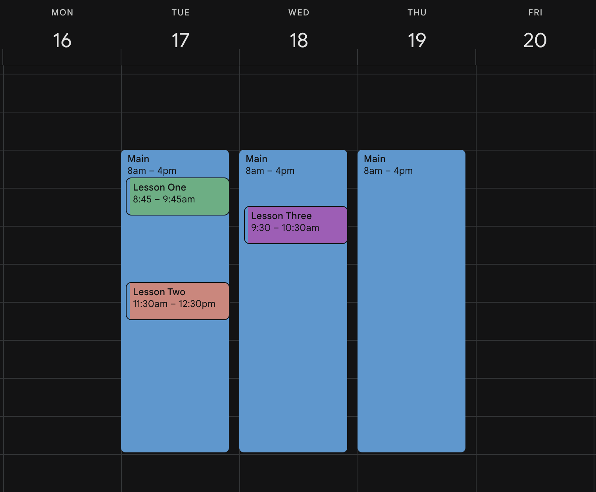

## Schedule Management

Tutor should be able to define his schedule as following:

1. **Start date**: (required, default is _today_) defines when the schedule should be activated. _e.g., 11/12/2024_
2. **End date** (optional) defines when the schedule should be obsolete. _e.g., 20/12/2024_
3. **Start time**: (required) The start of the session _e.g., 12:30_
   > Note that only xx:00, xx:15, xx:30, and xx:45 minutes are allowed. e.g., 12:00, 12:15, 12:30 and 12:45.
4. **End time**: (required) The end of the session.
5. **Frequency**: _daily_, or _weekly_ or _montly_ (default is _daily_).
6. **Weekdays**: Which days of the week should this schedule applied. Default is _all-days_.
7. **Status**:
   - Draft: schedule will not be available for booking.
   - Active: schedule will be shared with students.
8. **Target**: this option only available for tutor mangers.
   - _Lessons_ - defined schedule will only be used to book _lessons_ (only shared with students.)
   - _Interviews_ - defined schedule will only be used to book _interviews_ (only shared with tutors).
   - _Both_ - defined schedule can be shared with both tutors and students.

Using information above tutor can define his schedule in the most flexible way.

##### Example

Let's define our LiteSpace Daily Standup schedule:

1. Start: 11/12/2024
2. End: N/A
3. Start: 4:30
4. End: 5:00
5. Frequency: Daily
6. Weekdays: Sun, Mon, Tue, Wed, and Thu.

##### Notes

- Tutor can define as many schedule rules as he wants unless it **contradicts** with other already defined schedule rules.
- Tutor can update or edit his already exited rules but he should be notifed (upon updating or deleting a rule) that all the lessons that will be affected by the updated schedule will be **canceled** which might impact his overall rating.
  - For the tutor to safely remove his schedule he can do the following:
    - Shrink the end date of the schedule rule to the earliest possible date (aka, the time of the final lesson associated with this schedule).
- Tutor can have the option to **force delete his schedule rule** along side its lessons/interviews while be willing to suffer from the consequences.

## Calendar

Tutor should be able to see his all his schedule rules in a calendar view along side the lessons/interviews associated with it.

Example:

